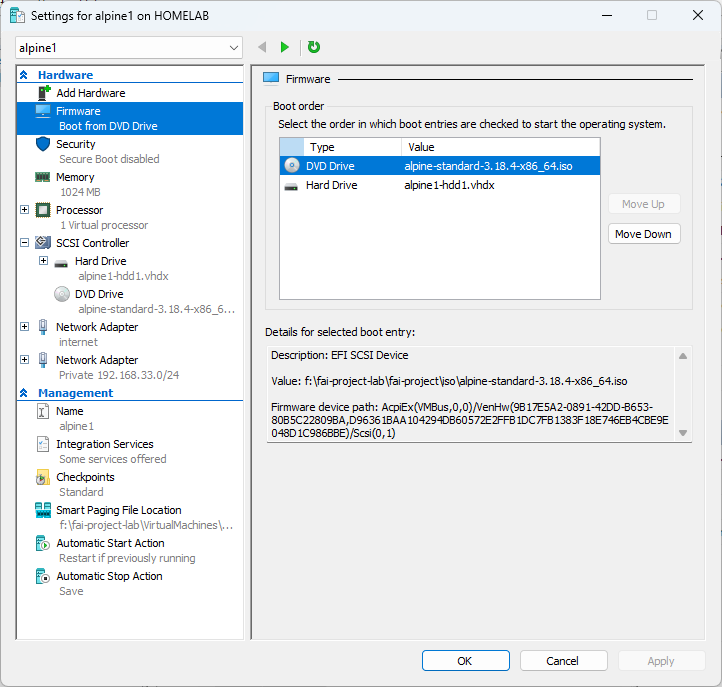
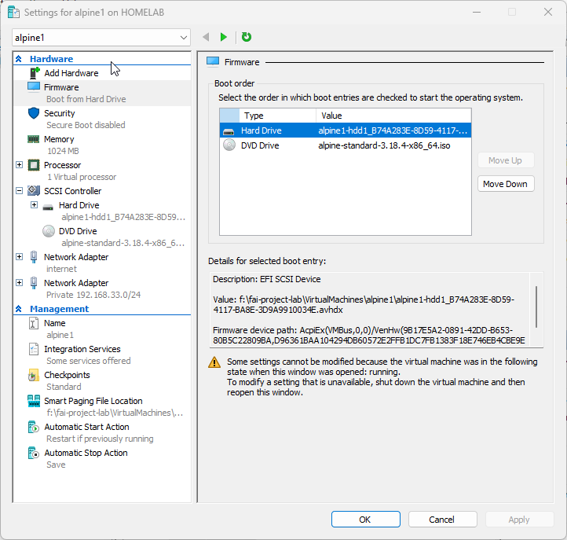
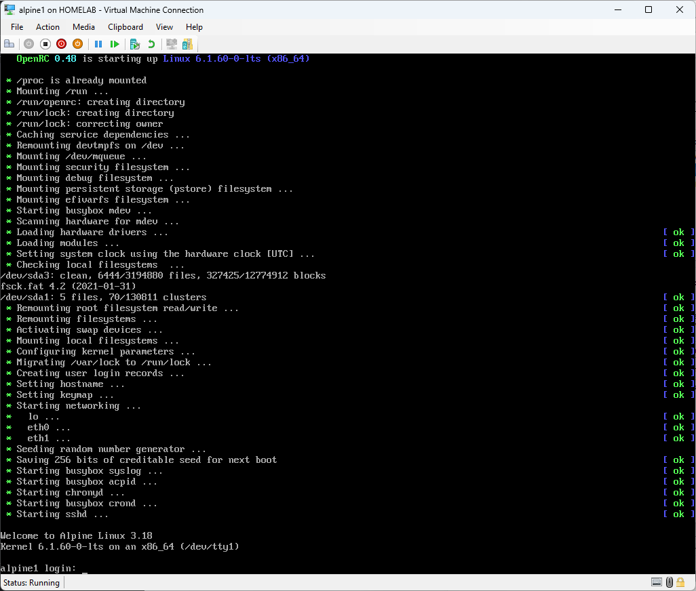
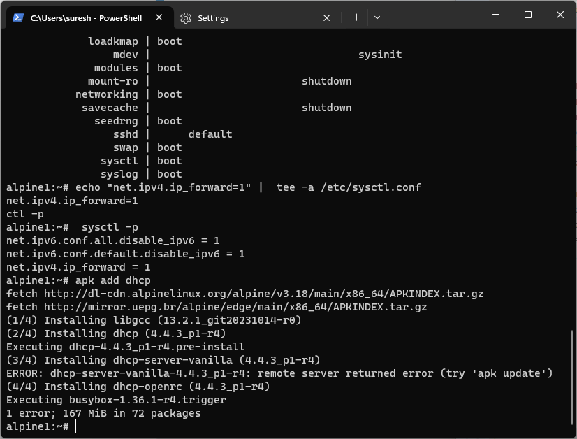

# Apline1 setup and configuration.

#### Key information
```
Alpine Default login
login : root
password : blank
```
## Hyper-V configuration for reference



## Alpine install ISO first boot


#### Disable IPv6 on Alpine 
In my setup IPv6 was not workinging if you have issues with IPv6, do disable before proceeding.

 Edit the /etc/sysctl.conf

```
vi /etc/sysctl.conf
# Manualy type in the following
# press [i] to be in insert /edit mode

net.ipv6.conf.all.disable_ipv6 = 1
# to save and exit following key press
# [esc] :x! [enter]

# reload the configuration
sysctl -p
```

## Install Alpine 
After logging on at the prompt type 
``` 
setup-alpine
``` 
You will be asked a series of questions . I have listed my selection.
```
Keyboard Layout : [us]
Keyboard variant : [us]
Hostname : [alpine1]
Network :
eth0: [dhcp]  # Internet connection
eth1: [192.168.33.1/24]
gateway: [none]
password : [abc123]
DNS Servers :
Timezone :[Singpore]
Proxy :[none]
ntp: default [chrony]  #if it takes long to complete , make sure ipv6 is disabled
Mirror :[f] # Detect and add fastest mirror
setup user : [no]
Which ssh server? [openssh]
allow root ssh login: [yes]
Allow ssh login : [yes]
Which disks would you like to use : [sda]
Disk Mode How would you like to use it ? [sys]
Erase the above disks and continue? [y]
```

## Installation begins.
Once the installtion is completed you will see the notice to reboot.
Before rebooting, change the boot sequence in Hyper-V for alpine1 to be Hard Drive first.

This will ensure the reboot will be to the Hard Disk.

On the apline1 Hyper-V console.
the prompt will display press [enter]
```
installation complete type reboot [enter]
```

## Setup completed 


These are the credentials for newly installed alpine1 . 
```
login: root
pass: abc123
```
This screen will appear , take note of the login prompt **'alpine1'**. Indicating the installation is completed.


## Connect via ssh
If you don't already know the Hyper-V console is not able to perform copy and paste operations. Via a terminal connection copy and paste functions make it easier to paste commands , especially the long ones.

## Steps to ssh.
- Identify the IP address  type `ip a` at the prompt.


- Use a terminal client. Putty is a good terminal to use. Windows 11 as a Terminal client installed I will be trying that in this example.But any terminal program can be used.

eth1 : 192.168.33.1 # This IP is accesible from your Hyper-V host.
 you may have to setup a static IP on the Network interface .
 in my case I used 192.168.33.10/24
 On Windows go to :
 
 Control Panel\Network and Internet\Network Connections
 
 Look for Connection name : vEthernet (Private 192.168.33.0 24)
 assign the static IP  192.168.33.10, Subnet Mask 255.255.255.0 

 
Back to ssh from Windows terminal
```
ssh -l root 192.168.33.1
```


## Configuring alpine1 as a router
In this setup, alpine1 is to perform 2 main functions.
- Internet gateway

  This function is to allow the devices in the Private network to access the internet. There is simple configuration.

```
# paste the following in the alpine1 ssh terminal
echo "net.ipv4.ip_forward=1" |  tee -a /etc/sysctl.conf

# reload the config using
sysctl -p

# enable IP routing on alpine1
apk add iptables
rc-update add iptables
iptables -A FORWARD -i eth1 -j ACCEPT
# eth0 is the external interface (connected to the internet)
iptables -t nat -A POSTROUTING -o eth0 -j MASQUERADE
/etc/init.d/iptables save

```

[Reference link to setup Alpine as a router](https://cylab.be/blog/221/a-light-nat-router-and-dhcp-server-with-alpine-linux)


- DHCP server 
  alpine1 will assign IP's to new clients on the network using DHCP.
  DHCP server is not installed by default. we have to install it.

Install DHCP and enable IP routing  on alpine1 
```
apk add dhcp
rc-update add dhcpd

```
Screenshot for routing and DHCP install 


## Configure DHCP
For the initial setup we will have the basic DHCP configuration.

Update the file /etc/dhcp/dhcpd.conf with the content below.

Method 1 using VI editor
```
vi /etc/dhcp/dhcpd.conf

subnet 192.168.33.0 netmask 255.255.255.0 {
  range 192.168.33.100 192.168.33.200;
  option domain-name-servers 8.8.8.8;
  option routers 192.168.33.1;
     host faisvr {
        hardware ethernet 00:15:5d:00:8a:3d; # change to your MAC address. 
        fixed-address 192.168.33.250;
    }
}
[esc] :x[enter] to save and exit
```
Method 2 echo to filename.
```
Paste the following in the alpine1 ssh terminal.

echo "subnet 192.168.33.0 netmask 255.255.255.0 {
  range 192.168.33.100 192.168.33.200;
  option domain-name-servers 8.8.8.8;
  option routers 192.168.33.1;
}" |  tee -a /etc/dhcp/dhcpd.conf

```
#### Restart the DHCP deamon
To refresh the updated configuration restart the DHCP services.
Any errors in configuration will appear at this point.
```
rc-service dhcpd start
rc-service networking restart
```
DHCP logs
```
cat /var/lib/dhcp/dhcpd.leases

cat /etc/dhcp/dhcpd.conf
```

### Setup is complete  for alpine1 server .


## Next step

We will proceed with the fai-server installation 

The validation for DHCP and Internet on the private network will be tested at a later stage.

Please continue with 
# [101-faiserver-server-setup.md](./101-faiserver-server-setup.md)
